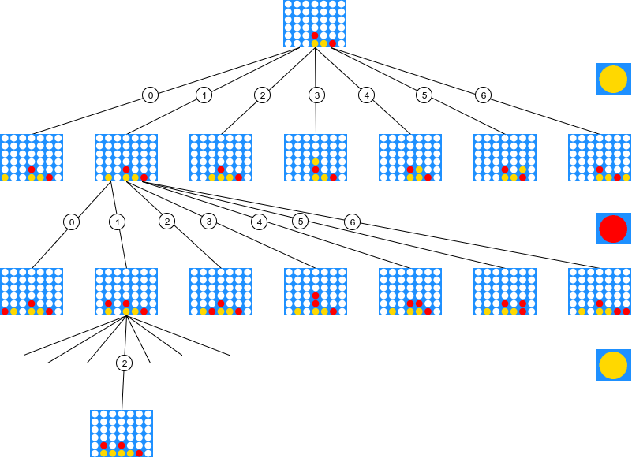
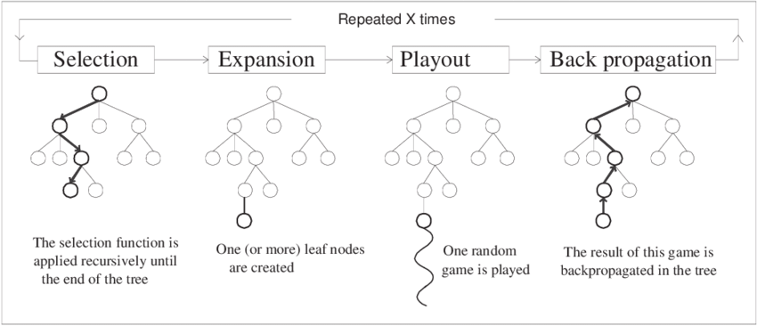
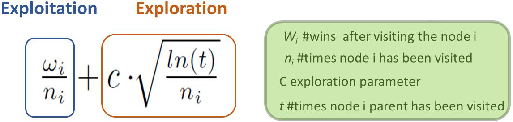

# connect4-montecarlo
Connect 4 AI using Monte Carlo Tree Search algorithm.

In this project the popular board game of [Connect Four](https://en.wikipedia.org/wiki/Connect_Four) has been designed and implemented by using the Pygame framework. The game is designed based on the classic boxed version of the game which is played on a 7x6 board. The Artificial Intelligence (AI) behind the opponent's moves uses the [Monte Carlo Tree Search](https://en.wikipedia.org/wiki/Monte_Carlo_tree_search) algorithm (MCTS) which is one of the first heuristic search that doesn't require apriori knoledge of the game to compute an heuristic function (like many other classic AI algorithms such as [Minimax](https://en.wikipedia.org/wiki/Minimax)). The MCTS algorithm estimates winning probabilities of board states based on random simulations, the more time the algorithm can run, the more accurate the prediction are.

## Aim of the project
The aim for this project was to implement the MCTS algorithm on a fairly simple game to investigate the true potential of its capabilities in regards of how much time the program is allowed to "think" in advance for a move. The algorithm has been implemented following the classic four steps of:

1. Selection;
2. Expansion;
3. Simulation;
4. Backpropagation;

For further optimization an Upper Confidence bounds applied to Trees (UCT) function has been implemented, which balance the exploitation of promising node with the exploration of the tree.

**N.B.**
The coding of this implementation (aside from having a theoretical schema of the algorithm) has been done by myself from scratch without using available libraries and without looking up similar implementations in order to be more challenging for myself and to have a better understanting of the algorithm functioning as a whole.

## MCTS algorithm explanation
This AI algorithm is really a search algorithm that computes in advance possible states (board configurations) reachable by following the moves allowed by the game rules. While a simple brute force solution with no apriori knowledge (by using for example [Breadth First Search](https://en.wikipedia.org/wiki/Breadth-first_search)) would look up in the worst case 4531985219092 board states, MCTS cut down this search by choosing to explore more promising nodes first based on its estimates of the UCT value.

As previously mentioned, this algorithm is composed of four total steps:

- **Selection**: In the first step, starting from the initial board, the tree is searched one layer deeper and the path taken follows always the child with higher UCT computed value (further explanation of this index later). If some of the children of a node haven't been explored and so, no probability value is yet assigned to them, an unexplored child is selected with a policy (for example, the far most left one);

- **Expansion**: After selecting a node, if all the other nodes in the same layer has been explored at least ones, generate its children node and select, for example, the far most left one. If the node happens to be a terminal one, select the node next to it for expansion;

- **Simulation**: From the selected node run a simulated game in which every player move is played randomly until a terminal node is reached and a score is retrieved (Win: +1, Tie: 0, Lose: -1);

- **Backpropagation**: Starting from the terminal node reached in the simulation, increment the number of visits of that node by 1 and sum or subtract (depending on that board's player turn respectively) the score obtained in the simulation. Then recursively backtrack to the parent of that node and repeat the process until the root node is reached;

When the given time expires, the algorithm returns the move that leads to the child of the root node who has the largest number of visits, meaning that this move has been choosen most of the times during simulations as it allowed to reach winning states with more probability than the other nodes in the first layer.

## Upper Bounds applied to Trees (UCT)
The main difficulty in selecting child nodes in the selection step, is maintaining some balance between the exploitation of the high average win rate to choose the most promising nodes right away, and the exploration of moves with few simulations as, of course, in unexplored path could resides the best winning move. The UCT value for a node is composed by two terms:

- **Exploitation term**: This term estimates the pure average winning rate by choosing to go down that node (but this doesn't account for how much realiable the estimate is, the node could be explored just ones);

- **Exploration term**: This term is higher for moves that has few simulations (meaning we should visit an unexplored node as we are not sure about its winning rate);

The correct balancing of this two behaviours can not only increase the performance but also increase the confidence about the probability estimation given by MCTS algorithm.

## Contacts
If you have any issues and/or questions don't hesitate to contact me at the e-mail address provided below. This was just a fun project and any suggestions to improve the AI will be welcomed as well.

lorenzo.gualniera@gmail.com

## Screenshots

